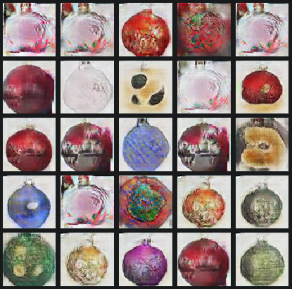

# Variations of DCGAN for Christmas balls 
There are two implementations in pytorch and tensorflow but they do not represent the same model.

Here are some results for a dataset of only 857 images:

